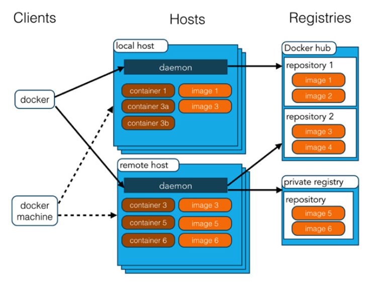

# Introduction

This chapter will be about introduction to Elasticsearch-Logstash-Kibana (ELK) stack and our underlying technologies.  We will begin by explaining some background on the ELK we use, ATLAS grid system and dCache billing log files and more, then move on to how to get Docker running on your system and finally how to get it set up to start working with. After reading this introcuntion and the following chapters, we expect that you will easily start running your own ELK instance on Docker.

## Distributed grid systems and dCache storage system used by them

In a ATLAS distributed grid site, its transfers and job efficiencies are monitored by some central dashboard systems such as the Rucio and Big PanDA. Each grid site has not been checked only by the latest status in the dashboards, also by periodic checks such as nagios, availability tests (e.g. HammerCloud) and so on. Furthermore, many of these systems are dealt with by many experts, central shifters and the national computing facilities/groups with having several remote meetings/communications they can work with. So, one grid site can collaborate with different groups of people in different monitoring ways simultaneously within the same experiment, in our case, ATLAS. This allows us to distribute several types of monitoring and administration tasks that are possible in both centralized systems and hierarchical models [8]. As for a storage system of German ATLAS computing Tier1/Tier2 sites, dCache storage system developed by DESY is widely used. The dCache can use hierarchical storage management (e.g. over many RAID disks and tapes), provides mechanisms to automatically increase performance and balance loads, increase resilience and availability [9]. It also supplies advanced control systems and various grid protocols to manage data as well as data workflow in each site.

## About Elasticsearch-Logstash-Kibana (ELK)

What is the ELK stack, and why should we care? ELK stack deliver actionable insights in real time for almost any type of structured and unstructured data source, at any scale. From centralizing infrastructure logs, traces, and metrics to deliver administrators. ELK is a combined system that parse the records, collect and display information of different log files or messages so that one can recall and display specific records [4]. In our practical use-case, final outcomes given by the Kibana dashbaord has been displayed by internal/external dCache data workflow and information recorded by its billing log files so far. Many organizations worldwide are using the ELK Stack for various mission-critical use cases in ATLAS and some large Tier1s as well. 

## Docker

Docker has become the de facto standard that developers and system administrators use for packaging, deploying, and running distributed applications. It provides tools for simplifying mission-critial operations and administrations by enabling developers to create templates called images that can be used to create lightweight virtual machines called containers, which include their applications and all of their applications’ dependencies. These lightweight virtual machines can be promoted through testing and production environments where system administrators deploy and run them.

Similar to the popular version control software Git, Docker has a social aspect, in that developers and administrators are able to share their images via Docker Hub (Figure 1-1). Docker is an open-source solution that runs natively on Linux but also works on Windows and Mac using a lightweight Linux distribution and VirtualBox. Many tools have also grown up around Docker to make it easier to manage and orchestrate complex distributed applications such as grid monitoring tools and the ELK stack.

## Docker compose and Gantry command

Docker compose is a tool for defining and running multi-container Docker applications. With docker-compose command, one uses a YAML file to configure the application’s services. Then, with a single docker-compose command, the one create and start all the services from its configuration. 

The docker-compose command works in all environments we need: production, staging, development, testing, as well as Continuous Integration (CI) workflows. We can learn more about each case in our cookbook chapter. In our settings, we simply implemented a wrapper command, called mad-gantry, which is a wrapper of docker-compose, making easier to generate docker template and docker instance template for different monitoring tools we have developed such HappyFace and now the ELK stack. 

The concept of our 'Gantry' is following

*       Simple design (pre-defined YAML files and its settings are given, and easily re-generated)
*       A wrapper of docker-compose
*       Easily distributed or separated by one config file
*       Standardisable and adaptable for many sites, monitoring tools and different local settings
*       Checking if services are running
*       Syncronising the tools and configurations with the code in the Git repository

