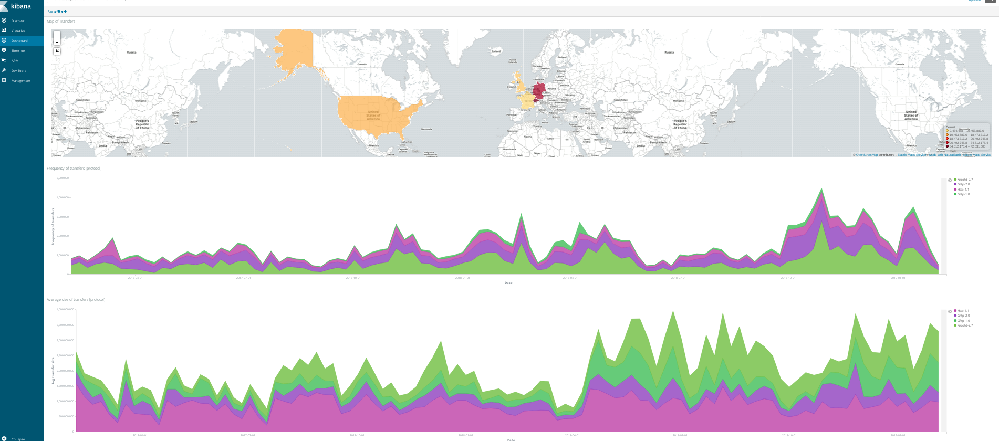
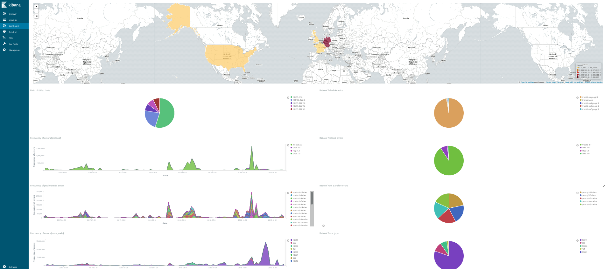

# Kibana

Kibana is an open source analytics and visualization platform designed to work with Elasticsearch [4][6]. We use Kibana to search, view, and interact with data stored in Elasticsearch indices. We can easily perform the data analysis and visualize our data in a variety of charts, tables, and maps. Kibana makes a large local site easy to understand large volumes of data, for instance, dCache billing log. Its simple, browser-based interface enables you to quickly create and share dynamic dashboards that display changes to Elasticsearch queries in real time.

