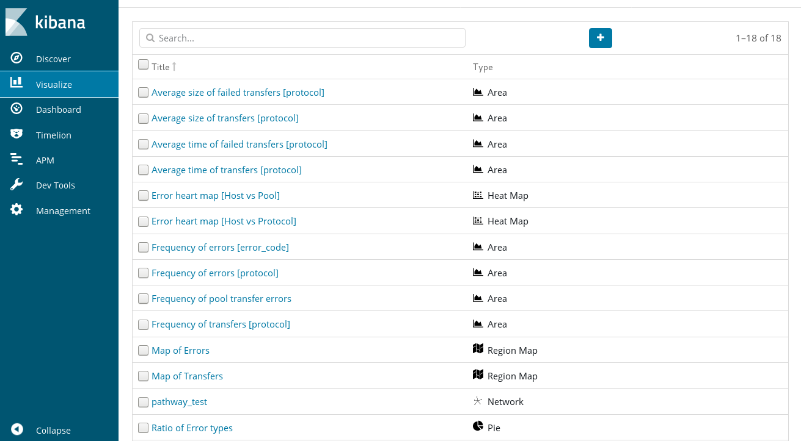
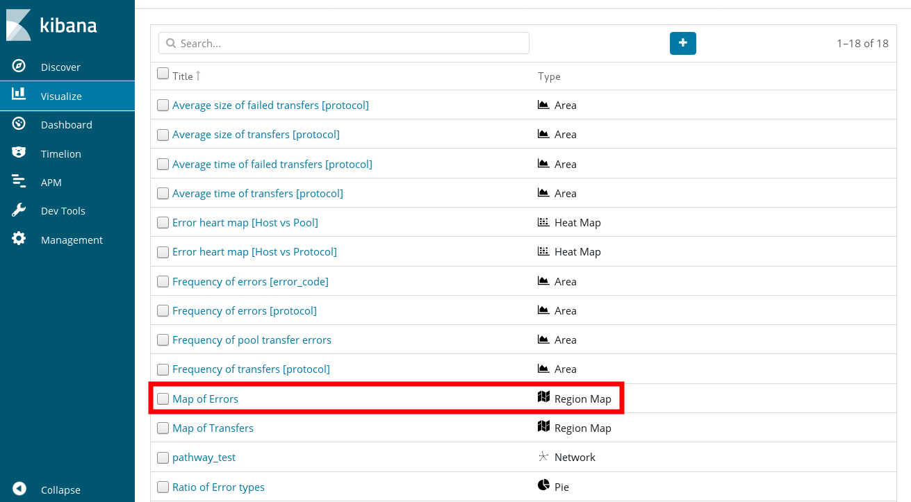
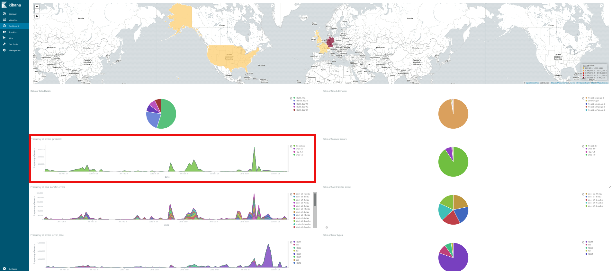

# Cookbook

## Running ELK stack in a ATLAS Tier2 site

* Cloning the main command and generating ELK templates

    $  git clone https://github.com/HappyFaceGoettingen/mad-gantry.git

    $  cd mad-gantry

    $  ./mad-gantry -t templates/docker-elk -b

    $  ./mad-gantry -D -a setup

    $ ls payloads/data/GoeGridELK

    billing  elasticsearch_index_data

* Copy billing logs into the billing directory (Note: indices will be kept in the 'elasticsearch_index_data' directory)

* Turn GoeGridELK instance up

    $  ./mad-gantry -s GoeGridELK -a up

    $ docker ps

## Configuration files and templates
There are some templates for ELK and dCache. These can most easily be configured by copying them. Please note the templates of ELK used for the test instance above mentioned can be found in 'configs/customs/GoeGridELK' and the templates are copied into 'ship/GoeGridELK' directory when it is set up. The interal configuration parameters in the template files, such as '__SITE__', '__PORT__' and so, on are adjusted by a configuration of 'ticket.conf'. 

For instance, the site names and the docker images of 'GoeGridELK' are defined by Tier3 section of the 'ticket.conf' file.

      ## ALL level3 sites (= Level3), level 3 sites are not in a tree structure
      ALL_LEVEL3_SITES=(AdminServer ApplicationBuilder GoeGridELK)
      ALL_LEVEL3_IMAGES=("happyface/admin-server.el7" "" "happyface/kibana")
      ALL_LEVEL3_HOSTS=($CLOUD0 $CLOUD0 $CLOUD0)
      ALL_LEVEL3_PORTS=(101 102 103)
      ALL_LEVEL3_SHIPS=("" "" "docker-elk")

When the GoeGridELK and setup option of the gantry command are called, the ship YAML file (ship/GoeGridELK/docker-compose.yml) generated and the custom tempalates are copied (from 'configs/customs/GoeGridELK') to 'payloads/sites/GoeGridELK'.

   * configs/customs/GoeGridELK/kibana/kibana.yml

Default Kibana configuration from kibana-docker.

      ## from https://github.com/elastic/kibana-docker/blob/master/build/kibana/config/kibana.yml
      #
      server.name: kibana
      server.host: "0"
      elasticsearch.url: http://__SITE__elasticsearch:__PORT__
      
      ## Disable X-Pack
      ## see https://www.elastic.co/guide/en/x-pack/current/xpack-settings.html
      ##     https://www.elastic.co/guide/en/x-pack/current/installing-xpack.html#xpack-enabling
      #
      xpack.security.enabled: false
      xpack.monitoring.enabled: false
      xpack.ml.enabled: false
      xpack.graph.enabled: true
      xpack.reporting.enabled: false
      xpack.grokdebugger.enabled: false

   * ship/GoeGridELK/docker-compose.yml

A final template for Docker Compose

     Version: "2.0"
        services:
        
        # ELK framework Ship Platform
        goegridelkelasticsearch:
        image: happyface/elasticsearch
        volumes:
           - "/home/gen/mad-gantry/payloads/ssh:/root/.ssh"
           - "/home/gen/mad-gantry/payloads/data/GoeGridELK/billing:/billing"
           - "/home/gen/mad-gantry/payloads/sites/GoeGridELK/elasticsearch/elasticsearch.yml:/usr/share/elasticsearch/config/elasticsearch.yml"
           - "/home/gen/mad-gantry/payloads/data/GoeGridELK/elasticsearch_index_data:/usr/share/elasticsearch/data"
        ports:
           - "9200:9200"
           - "9300:9300"
        environment:
          ES_JAVA_OPTS: "-Xmx7g -Xms7g"
        networks:
           - elk
        .......

## Manipulating Kibana Visualisation

The Kibana web interface contains under the menu point "Visualize" tab listing from all plots we created. The visualisation plots can also be redirected.

## Manipulating Kibana Dashboard

Each visualisation plot is gathered and sorted by the main dashboard, so that one changes the visualisation plot it will affect the dashboard view.

## Saving Kibana dashboard
In our case, we implemented our own darshboard (ID: WeXmuoICywmhE8FvCht). So, exporting the JSON output, and re-using it when the service is up again.

     $ id=WeXmuoICywmhE8FvCht
     $ export_url="http://localhost:20261/api/kibana/dashboards/export?dashboard=$id"
     $ GET "$export_url" > export.json

     $ import_url="http://localhost:20261/api/kibana/dashboards/import"
     $ curl -u elastic:changeme -k -XPOST "$import_url" \
         -H 'Content-Type: application/json' -H "kbn-xsrf: true" -d @export.json

## Command snippets for Elasticsearch
There are many client tools for Elasticsearch. These can most easily be communicated through RESTful web service in Elasticsearch engine.

* List indexes

     $ curl 'localhost:9200/_cat/indices?v'

* Filter if error_code in billing log is '0'

     $ curl -XPOST 'localhost:9200/_search' -d '{"query": { "bool": { "filter": { "term": {"error_code": "0"} } } } }'

* Simple search

     $ curl 'localhost:9200/_search?pretty=true'

* Simple matches using pool_name in 'billing log'

     $ curl -XPOST 'localhost:9200/_search?pretty=true' -d '{"query": { "match_all": {} } }'

     $ curl -XPOST 'localhost:9200/_search?pretty=true' -d '{"query": { "match": { "pool_name": "pool-p1-1-data" } } }'

* Aggregations

     $ curl -XPOST 'localhost:9200/_search' -d '{"aggs": { "all_interests": { "terms": {"field": "size"} } } }'
     $ curl -XPOST 'localhost:9200/_search' -d '{"aggs": { "queries": { "terms": {"field": "size"} } } }'
     
     $ curl -XPOST 'localhost:9200/_search' -d '{"query": { "match": { "pool_name": "pool-p1-1-data" } }, "aggs": { "all_interests": { "terms": {"field": "size"} } } }'
     $ curl -XPOST 'localhost:9200/_search' -d '{"query": { "match": { "pool_name": "pool-p1-1-data" } }, "aggs": { "queries": { "terms": {"field": "size"} } } }'

